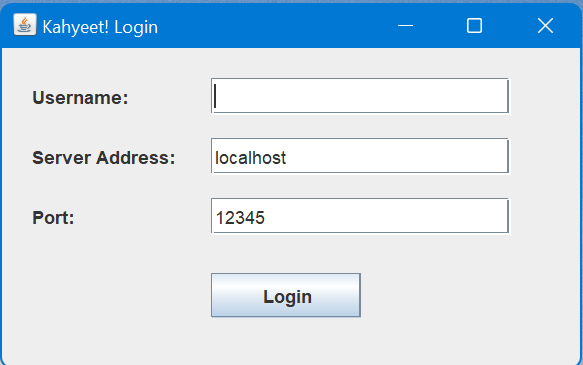
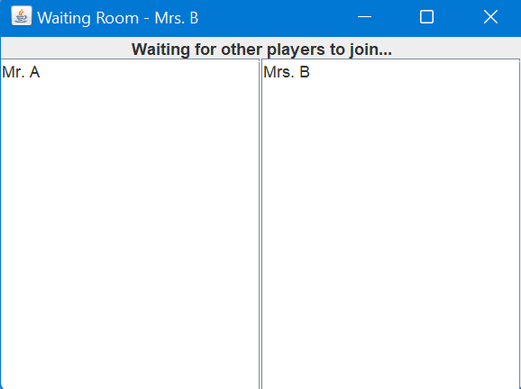
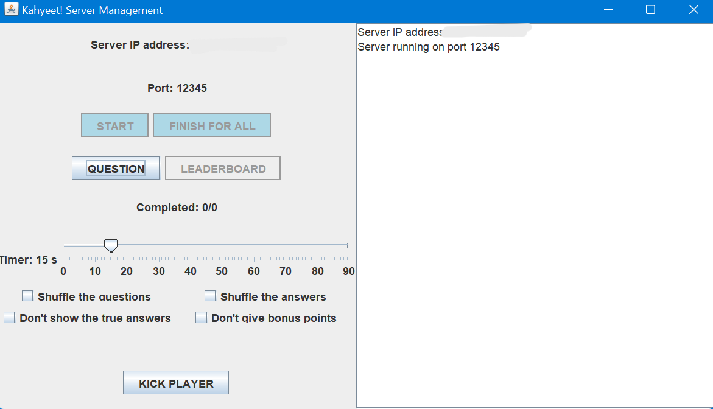
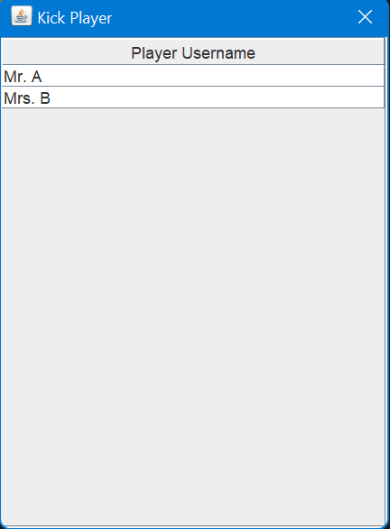
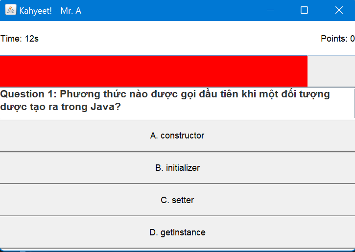
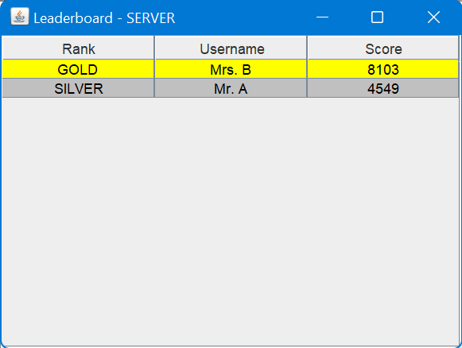

# Kahyeet Multiplayer Quiz Game

Kahyeet is a multiplayer quiz game inspired by Kahoot. This project consists of two main components - Client and Server, both of which support multiple user interactions and real-time updates. This project directory includes three primary folders: `App`, `Code`, and `Pic`.

## Project Structure

```
Kahyeet_Project
├── App
│   ├── Client
│   │   ├── Kahyeet.exe                # Client executable
│   │   └── Sound                      # Contains sound files for client
│   └── Server
│       ├── Kahyeet_Server.exe         # Server executable
│       ├── scores.txt                 # Stores players' scores
│       └── questions.txt              # Stores quiz questions and answers
├── Code
│   ├── Client
│   │   ├── Client.java
│   │   ├── GameUI.java
│   │   ├── LeaderUI.java
│   │   ├── LoginUI.java               # Main entry point for client
│   │   ├── Question.java
│   │   ├── Sound.java
│   │   ├── WaitUI.java
│   │   ├── Kahyeet.jar
│   │   ├── bin                        # Compiled classes
│   │   └── Sound                      # Contains sound files for client
│   └── Server
│       ├── ClientHandler.java
│       ├── LeaderServer.java
│       ├── Player.java
│       ├── Server.java                # Main entry point for server
│       ├── Kahyeet_Server.jar
│       ├── scores.txt
│       ├── questions.txt
│       └── bin                        # Compiled classes
└── Pic
    ├── KickPlayer_UI.png
    ├── Leaderboard.png
    ├── Player_Login.png
    ├── Question_UI.png
    ├── Server_Management.png
    └── Waiting_Room.png
```

## Project Files

- **App Folder**: Contains the compiled executables (`Kahyeet.exe` for the client and `Kahyeet_Server.exe` for the server) for immediate execution.
- **Code Folder**: Contains source code files and compiled classes for both the client and server.
- **Pic Folder**: Contains images for documentation and README display.

## Setup Instructions

1. **Download** and extract the project in a directory without spaces or special characters.
2. **Edit Code**: The `Code` folder contains editable Java files for Client and Server.
3. **Run Application**:
   - Use the `.exe` files in the `App` folder to launch the server and client applications directly.
   - For Java developers, you can also use `Kahyeet.jar` and `Kahyeet_Server.jar` in the `Code` folder for running the app in a Java environment.

## Usage

- **Launch Server**:
   - Run `Kahyeet_Server.exe` in `App/Server` or `Kahyeet_Server.jar` in `Code/Server`.
   - Server manages player connections, tracks scores, and handles game settings.
   - The `scores.txt` file records players' scores, while `questions.txt` holds the quiz content.
   
- **Launch Client**:
   - Run `Kahyeet.exe` in `App/Client` or `Kahyeet.jar` in `Code/Client`.
   - Use the `LoginUI` to log in with a unique username and join the game.

### Question Format

Questions in `questions.txt` should follow this format:

```
Question 1
Answer 1
Answer 2
Answer 3
Answer 4_@#
<empty line>

Question 2
Answer 1
Answer 2
Answer 3_@#
Answer 4
<empty line>
```

The correct answer for each question is marked with `_@#` after the answer text.

## Screenshots

### Interface Overview

<table>
  <tr>
    <th style="text-align:center;">Login Screen</th>
    <th style="text-align:center;">Waiting Room</th>
  </tr>
  <tr>
    <td style="text-align:center;">
      
    </td>
    <td style="text-align:center;">
      
    </td>
  </tr>
  <tr>
    <th style="text-align:center;">Server Management</th>
    <th style="text-align:center;">Kick Player Screen</th>
  </tr>
  <tr>
    <td style="text-align:center;">
      
    </td>
    <td style="text-align:center;">
      
    </td>
  </tr>
  <tr>
    <th style="text-align:center;">Game Screen</th>
    <th style="text-align:center;">Leaderboard</th>
  </tr>
  <tr>
    <td style="text-align:center;">
      
    </td>
    <td style="text-align:center;">
      
    </td>
  </tr>
</table>

## Notes

- The server logs player scores to `scores.txt` in the `App/Server` or `Code/Server` directory.
- Disconnected players are marked in the leaderboard and excluded from score saving if kicked.
- The `Sound` folder contains audio files used for background music and effects during gameplay.

Feel free to customize this project as needed for your learning or development purposes!